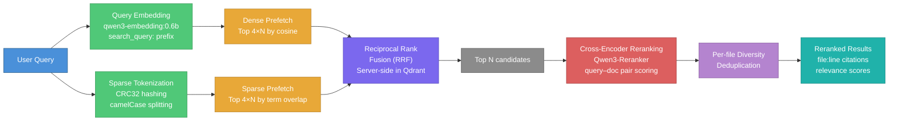
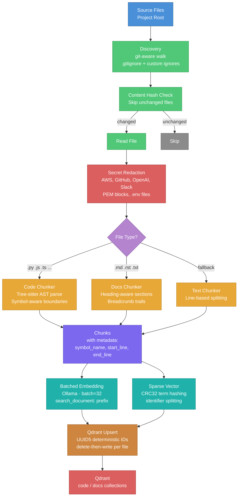

# rememory — Architecture Diagram

## System Overview

```mermaid
graph TB
    subgraph Clients["MCP Clients"]
        CC["Claude Code"]
        CD["Claude Desktop"]
        CU["Cursor"]
        WS["Windsurf"]
        VS["VS Code Copilot"]
    end

    subgraph MCP["MCP Server — memory_mcp"]
        direction TB
        SRV["server.py<br/>FastMCP over stdio<br/>14 tools + 1 prompt"]
        UPD["updater.py<br/>Auto-update on startup<br/>git fast-forward"]
        HLT["health.py<br/>Self-healing<br/>ensure_services()"]
    end

    Clients -- "stdio / JSON-RPC" --> SRV
    SRV --> UPD
    SRV --> HLT

    subgraph Retrieval["Retrieval Pipeline — memory_mcp"]
        direction TB
        SCH["search.py<br/>Hybrid Search<br/>Dense + Sparse"]
        RRK["rerank.py<br/>Cross-Encoder Reranking<br/>Qwen3-Reranker"]
        MEM["memories.py<br/>MemoryStore<br/>CRUD + dedup"]
    end

    SRV --> SCH
    SRV --> MEM
    SCH --> RRK

    subgraph Indexing["Indexing Pipeline — indexer/"]
        direction TB
        CLI["cli.py<br/>CLI entry point<br/>index / sync / status"]
        DSC["discovery.py<br/>File discovery<br/>git-aware, .gitignore"]
        RDC["redact.py<br/>Secret redaction<br/>AWS, GitHub, PEM, ..."]
        subgraph Chunkers["Chunkers"]
            CCH["code.py<br/>Tree-sitter<br/>symbol-aware"]
            DCH["docs.py<br/>Heading-aware<br/>breadcrumb trail"]
            TCH["text.py<br/>Fallback<br/>line-based"]
        end
        PIP["pipeline.py<br/>Orchestration<br/>discover → chunk → embed → store"]
        EMB["embedder.py<br/>Batched Embedding<br/>qwen3-embedding:0.6b"]
        SPR["sparse.py<br/>Sparse Vectors<br/>CRC32 token hashing"]
        STR["store.py<br/>Qdrant Writes<br/>deterministic UUID5 ids"]
        LCK["lockfile.py<br/>Index Lock<br/>serialize writers"]
    end

    PIP --> DSC
    PIP --> RDC
    DSC --> Chunkers
    PIP --> Chunkers
    PIP --> EMB
    PIP --> SPR
    PIP --> STR
    CLI --> PIP

    subgraph Infra["Local Infrastructure"]
        direction TB
        QDR["Qdrant v1.18.3<br/>Docker · 127.0.0.1 only<br/>REST :6333 · gRPC :6334"]
        OLL["Ollama<br/>Local AI runtime"]
        subgraph Models["Local Models"]
            EMM["qwen3-embedding:0.6b<br/>1024-dim embeddings"]
            RRM["Qwen3-Reranker<br/>Cross-encoder scoring"]
        end
        OLL --> Models
    end

    EMB -- "POST /api/embed" --> OLL
    SCH -- "POST /api/embed<br/>(query vector)" --> OLL
    RRK -- "POST /api/generate<br/>(logprobs)" --> OLL
    STR -- "gRPC upsert" --> QDR
    SCH -- "Hybrid prefetch<br/>+ RRF fusion" --> QDR
    MEM -- "CRUD" --> QDR
    HLT -. "docker start<br/>if container down" .-> QDR

    subgraph Storage["Data Layer — data/"]
        direction TB
        QDS["qdrant/storage/<br/>Vectors + payloads + WAL"]
        QSN["qdrant/snapshots/<br/>Point-in-time backups"]
        BKP["backups/<br/>Daily JSON exports<br/>payload-only, model-agnostic"]
    end

    QDR --> QDS
    QDR --> QSN

    subgraph Collections["Qdrant Collections"]
        COL_CODE["code<br/>Source code chunks<br/>Dense + Sparse vectors"]
        COL_DOCS["docs<br/>Documentation chunks<br/>Dense + Sparse vectors"]
        COL_MEM["memory<br/>Stored knowledge<br/>Decisions, handoffs, notes"]
    end

    QDS --> Collections

    subgraph Config["Configuration — config/"]
        direction TB
        CFG_E["embedding.yaml<br/>Model, dims, prefixes"]
        CFG_I["indexing.yaml<br/>Chunk sizes, ignores"]
        CFG_C["collections.yaml<br/>Qdrant schema"]
        CFG_P["projects.yaml<br/>Project registry"]
        CFG_Q["qdrant.yaml<br/>Qdrant settings"]
        CFG_R["runtime.json<br/>Discovered ports"]
    end

    SRV --> Config
    PIP --> Config

    subgraph DesktopApp["Desktop App — app/"]
        direction TB
        APP["main.py<br/>Tray icon + webview"]
        WIN["window.py<br/>Window management"]
        BKD["backend.py<br/>pywebview API bridge"]
        subgraph UI["Dashboard UI — app/ui/"]
            HTML["index.html"]
            CSS["styles.css"]
            JS["app.js"]
        end
        APP --> WIN
        APP --> BKD
        BKD --> UI
    end

    BKD -- "Start / Stop / Sync / Status" --> QDR
    BKD -- "Load / Unload models" --> OLL
    BKD -. "Reads" .-> Config

    subgraph Automation["Background Automation — scripts/"]
        direction TB
        SCH_SYNC["sync.ps1 / scheduled.py<br/>30-min incremental sync"]
        SCH_BKP["backup.ps1 / export_memory.py<br/>Daily memory export"]
        DIAG["diagnose.py<br/>Stdlib-only diagnostic"]
        CONN["connect.py<br/>Print client config"]
        REC["recover_storage.py<br/>Corrupt collection repair"]
    end

    SCH_SYNC --> CLI
    SCH_BKP --> BKP

    classDef client fill:#4A90D9,stroke:#2C5F8A,color:#fff,rx:8
    classDef server fill:#7B68EE,stroke:#5A4FC0,color:#fff,rx:8
    classDef retrieval fill:#E8A838,stroke:#B8832A,color:#fff,rx:8
    classDef indexer fill:#50C878,stroke:#3A9A5A,color:#fff,rx:8
    classDef infra fill:#DC5F5F,stroke:#A84040,color:#fff,rx:8
    classDef storage fill:#8B8B8B,stroke:#5F5F5F,color:#fff,rx:8
    classDef config fill:#B484CF,stroke:#8A60A0,color:#fff,rx:8
    classDef app fill:#20B2AA,stroke:#178A84,color:#fff,rx:8
    classDef auto fill:#CD853F,stroke:#9A6230,color:#fff,rx:8

    class CC,CD,CU,WS,VS client
    class SRV,UPD,HLT server
    class SCH,RRK,MEM retrieval
    class CLI,DSC,RDC,CCH,DCH,TCH,PIP,EMB,SPR,STR,LCK indexer
    class QDR,OLL,EMM,RRM infra
    class QDS,QSN,BKP storage
    class CFG_E,CFG_I,CFG_C,CFG_P,CFG_Q,CFG_R config
    class APP,WIN,BKD,HTML,CSS,JS app
    class SCH_SYNC,SCH_BKP,DIAG,CONN,REC auto
    class COL_CODE,COL_DOCS,COL_MEM storage
```

---

## Retrieval Pipeline (Detail)

---

## Indexing Pipeline (Detail)

---

## Component Legend

| Color | Subsystem | Key Files |
|-------|-----------|-----------|
| 🔵 Blue | MCP Clients | Claude Code, Cursor, Windsurf, VS Code |
| 🟣 Purple | MCP Server | [`server.py`](file:///d:/rememory/memory_mcp/server.py), [`updater.py`](file:///d:/rememory/memory_mcp/updater.py), [`health.py`](file:///d:/rememory/memory_mcp/health.py) |
| 🟠 Orange | Retrieval | [`search.py`](file:///d:/rememory/memory_mcp/search.py), [`rerank.py`](file:///d:/rememory/memory_mcp/rerank.py), [`memories.py`](file:///d:/rememory/memory_mcp/memories.py) |
| 🟢 Green | Indexing | [`pipeline.py`](file:///d:/rememory/indexer/pipeline.py), [`discovery.py`](file:///d:/rememory/indexer/discovery.py), [`embedder.py`](file:///d:/rememory/indexer/embedder.py) |
| 🔴 Red | Infrastructure | Qdrant (Docker), Ollama, local AI models |
| ⚫ Grey | Storage | `data/qdrant/`, `data/backups/`, 3 collections |
| 🟤 Brown | Automation | Scheduled sync, daily backup, diagnostics |
| 🩵 Teal | Desktop App | [`main.py`](file:///d:/rememory/app/main.py), [`backend.py`](file:///d:/rememory/app/backend.py), dashboard UI |

> [!NOTE]
> Everything runs locally — no cloud, no API keys, no telemetry. Qdrant is bound to `127.0.0.1` only, and Ollama runs the two small models (~2.7 GB VRAM) on-device.
